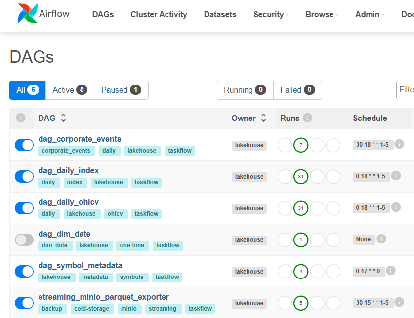
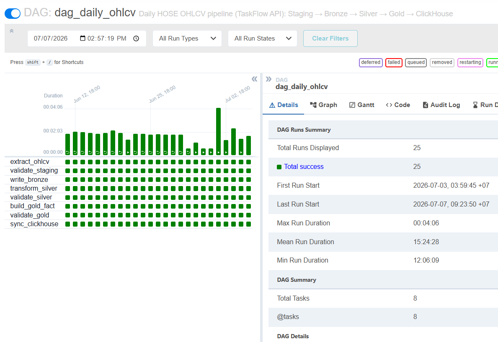
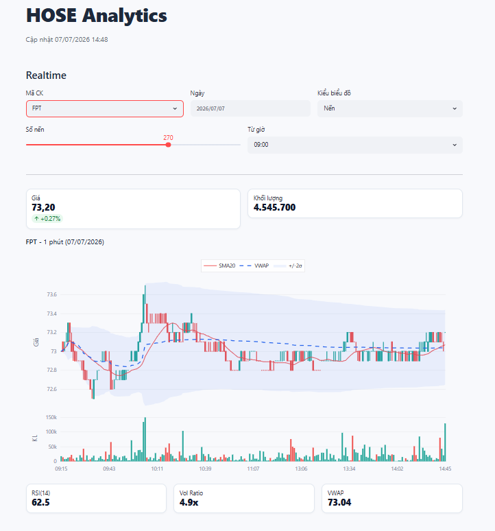
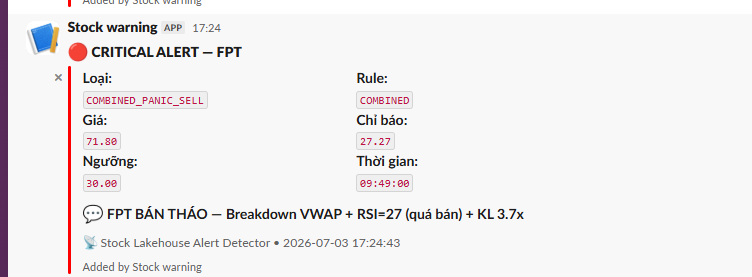
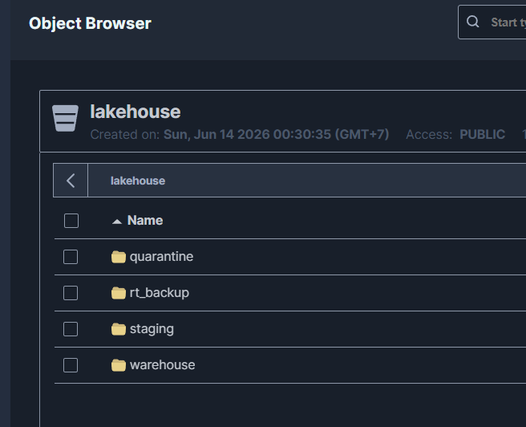
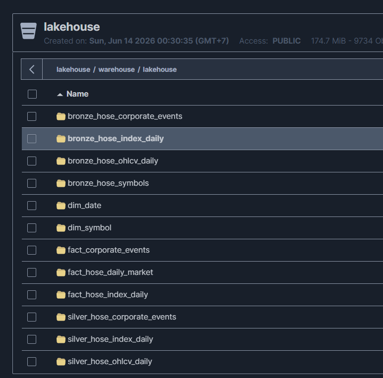

# 📊 HOSE Stock Data Lakehouse

Hệ thống thu thập, lưu trữ và phân tích dữ liệu chứng khoán sàn HOSE theo kiến trúc **Data Lakehouse**, sử dụng hoàn toàn công nghệ mã nguồn mở — chi phí bản quyền **$0**.

> **Đồ án thực tập:** Đặng Quốc Cường  
> **Mentor:** Bùi Lê Huy — Trung tâm CNTT Viettel (VTIT)

---

## Mục lục

- [Tổng quan](#tổng-quan)
- [Kiến trúc hệ thống](#kiến-trúc-hệ-thống)
- [Công nghệ sử dụng](#công-nghệ-sử-dụng)
- [Luồng Batch — Medallion Architecture](#luồng-batch--medallion-architecture)
- [Luồng Streaming — Detector-centric](#luồng-streaming--detector-centric)
- [Kiểm định chất lượng dữ liệu (DQ Framework)](#kiểm-định-chất-lượng-dữ-liệu-dq-framework)
- [Mô hình dữ liệu](#mô-hình-dữ-liệu)
- [Dashboard Streamlit](#dashboard-streamlit)
- [Cấu trúc thư mục](#cấu-trúc-thư-mục)
- [Hướng dẫn triển khai](#hướng-dẫn-triển-khai)
- [KPIs & Kết quả đo lường](#kpis--kết-quả-đo-lường)
- [Hướng phát triển](#hướng-phát-triển)

---

## Tổng quan

Thị trường chứng khoán HOSE (400+ mã niêm yết) phát sinh dữ liệu liên tục theo hai luồng:

| Luồng | Nguồn | Mục đích |
|-------|-------|----------|
| **Batch (EOD)** | VNStock / VCI API | Dữ liệu OHLCV ngày, chỉ số VN-Index/VN30, sự kiện doanh nghiệp — phục vụ phân tích xu hướng & backtest |
| **Streaming (Intraday)** | DNSE WebSocket | Nến 1 phút realtime — theo dõi & cảnh báo bất thường trong phiên giao dịch |

**Phạm vi theo dõi realtime:** 5 mã trọng điểm — **FPT**, **VCB**, **HPG**, **VNM**, **MWG**.

---

## Kiến trúc hệ thống

```
┌────────────────────────── BATCH ───────────────────────────┐  ┌──────────── STREAMING ──────────────┐
│                                                            │  │                                     │
│  API dữ liệu (VNStock / VCI)                              │  │  WebSocket DNSE                     │
│       │                                                    │  │       │  (nến 1 phút realtime)       │
│       ▼                                                    │  │       ▼                             │
│  Airflow DAGs (6 DAG điều phối)                            │  │  Apache Kafka (KRaft)               │
│       │                                                    │  │       │                             │
│       ├──► Staging    (MinIO Parquet — dữ liệu thô)       │  │       ▼                             │
│       ├──► Bronze     (Iceberg — ép kiểu, lineage)        │  │  ClickHouse Kafka Engine            │
│       ├──► Silver     (Iceberg — làm sạch, dedupe)        │  │       │                             │
│       └──► Gold       (Iceberg — Star Schema + chỉ báo)   │  │       ▼ (Materialized View)         │
│                │                                           │  │  Bảng nến realtime 1m               │
│                ▼                                           │  │       │                             │
│          ClickHouse (Serving — OLAP)                       │  │       ▼                             │
│                │                                           │  │  Alert Detector ←─ (đọc nến mới)   │
│                │  ←── giá đóng cửa ngày trước ────────────┼──┘       │  - Tính RSI, VWAP, σ        │
│                ▼                                           │         │  - Lọc quy tắc cảnh báo     │
│          Streamlit Dashboard ◄───────────────────────────────────── ├──► Bảng chỉ báo CH           │
│          (đọc chỉ báo tính sẵn)                            │         ├──► Slack alerts             │
│                                                            │         └──► Bảng nhật ký CH          │
└────────────────────────────────────────────────────────────┘
```

---

## Công nghệ sử dụng

| Lớp | Công nghệ | Lý do lựa chọn |
|-----|-----------|-----------------|
| Nguồn dữ liệu batch | VNStock / VCI API | Miễn phí, đủ lịch sử OHLCV và sự kiện doanh nghiệp HOSE |
| Nguồn dữ liệu realtime | DNSE WebSocket | Hỗ trợ nến 1 phút thời gian thực, xác thực HMAC |
| Xử lý dữ liệu | Python 3.12 + **Polars** | Nhanh hơn Pandas 5–10× nhờ đa luồng và lazy execution |
| Điều phối (Orchestration) | Apache Airflow | TaskFlow API trực quan, retry & giám sát tốt |
| Lưu trữ đối tượng | MinIO | Tương thích S3, dễ self-hosted |
| Định dạng bảng | Apache Iceberg | ACID transactions, time-travel, schema evolution |
| Message broker | Apache Kafka (KRaft) | Không cần ZooKeeper, vận hành đơn giản |
| OLAP serving | ClickHouse | Column-oriented, tối ưu truy vấn phân tích |
| Dashboard | Streamlit | Phát triển nhanh bằng Python, tích hợp mượt với ClickHouse |
| Cảnh báo | Slack Webhook | Đơn giản, tin cậy, hỗ trợ phân mức nghiêm trọng |
| Container hóa | Docker Compose (Profiles) | Khởi chạy toàn hệ thống bằng 1 lệnh |

---

## Luồng Batch — Medallion Architecture

### Dữ liệu di chuyển qua 4 tầng

```
Nguồn API (VNStock / VCI)
    │
    ▼
[STAGING]  MinIO Parquet
  → Lưu file thô, phân tách theo processing_date + batch_id
    │
    ▼
[BRONZE]   Iceberg Table
  → Ép kiểu dữ liệu, ghi nhận lineage (nguồn gốc)
  → Phân vùng theo tháng
    │
    ▼
[SILVER]   Iceberg Table
  → Làm sạch, chuẩn hóa tên cột, loại bỏ trùng lặp
  → Áp dụng bộ lọc chất lượng (DQ Framework)
  → Phân vùng theo tháng của trading_date
    │
    ▼
[GOLD]     Iceberg Table (Star Schema)
  → Tính sẵn chỉ báo kỹ thuật: SMA20, EMA20, RSI14, MACD
  → Tổ chức theo mô hình hình sao (dim + fact tables)
    │
    ▼
[CLICKHOUSE] Serving Layer
  → Đồng bộ từ Gold, phục vụ Dashboard với độ trễ tối thiểu
```

> **Chiến lược phân vùng:** Phân vùng theo **tháng** — cân bằng giữa small-files problem (theo ngày) và blast-radius lớn (theo năm).

> **Idempotency:** Mỗi tầng chạy lại nhiều lần với cùng tham số vẫn cho kết quả duy nhất. Cơ chế: ghi đè Iceberg + `DELETE WHERE date = X` trước khi insert lại trong ClickHouse.

### Điều phối bằng 6 Airflow DAGs

| DAG | Chức năng | Lịch chạy |
|-----|----------|-----------|
| `dag_daily_ohlcv` | Giá OHLCV toàn bộ mã HOSE | 18:00 T2–T6 |
| `dag_daily_index` | Chỉ số VN-Index, VN30 | 18:00 T2–T6 |
| `dag_symbol_metadata` | Thông tin cơ bản mã niêm yết | 17:00 CN |
| `dag_corporate_events` | Sự kiện chia cổ tức, phát hành thêm | 18:30 T2–T6 |
| `dag_dim_date` | Bảng chiều thời gian 2020–2030 | Thủ công (1 lần) |
| `minio_exporter_dag` | Backup streaming → MinIO Parquet | 15:30 T2–T6 |

> **Nguyên tắc:** Toàn bộ logic nghiệp vụ tách khỏi mã Airflow (Single Responsibility Principle) — dễ bảo trì và kiểm thử độc lập.

### Chỉ báo kỹ thuật tại Gold Layer

Gold layer áp dụng chiến lược **Full-recompute** — tính lại toàn bộ chuỗi chỉ báo mỗi lần chạy, loại bỏ lỗi lệch trạng thái (state-drift):

| Chỉ báo | Mô tả |
|---------|-------|
| SMA20 | Trung bình động đơn giản 20 phiên |
| EMA20 | Trung bình động hàm mũ 20 phiên |
| RSI14 | Chỉ số sức mạnh tương đối (Wilder's RSI) |
| MACD | Đường hội tụ phân kỳ trung bình động |
| Volume trung bình 20 phiên | Đánh giá thanh khoản |

---

## Luồng Streaming — Detector-centric

### Kiến trúc

```
WebSocket DNSE ──► Kafka (KRaft) ──► ClickHouse Kafka Engine
                                            │
                                  ┌─────────▼──────────┐
                                  │   ALERT DETECTOR    │
                                  │  (nguồn tính toán   │
                                  │   duy nhất)         │
                                  │                     │
                                  │  ✓ Tính VWAP        │
                                  │  ✓ Tính RSI         │
                                  │  ✓ Tính σ (sigma)   │
                                  │  ✓ Lọc quy tắc     │
                                  └────────┬────────────┘
                              ┌────────────┼───────────────┐
                              ▼            ▼               ▼
                     Bảng chỉ báo    Bảng nhật ký    Slack Webhook
                     ClickHouse      cảnh báo         (tức thời)
                         │
                         ▼
                   Streamlit Dashboard
                   (chỉ đọc — không tự tính)
```

**Ưu điểm:** Dashboard và Slack cùng đọc từ một bảng chỉ báo → **đồng nhất số liệu tuyệt đối**.

### Quy tắc cảnh báo (Alert Rules)

Hệ thống hỗ trợ **5 loại cảnh báo** với cơ chế chống spam (cooldown 5 phút/mã/loại):

| Loại cảnh báo | Điều kiện kích hoạt |
|---------------|---------------------|
| **VWAP band breach** | Giá vượt dải ±2σ của giá trung bình phiên |
| **RSI overbought** | RSI > 70 |
| **RSI oversold** | RSI < 30 |
| **Volume spike** | Khối lượng đột biến gấp 3× trung bình |
| **Combined risk** | Giá biến động mạnh + Khối lượng tăng vọt + RSI quá ngưỡng |

> Tất cả ngưỡng đều **cấu hình qua biến môi trường** (`.env`).

### RSI dùng chung Batch + Stream (DRY)

Thuật toán Wilder's RSI được đóng gói thành **1 module Python duy nhất**, sử dụng chung cho cả batch lẫn streaming — loại bỏ sai lệch toán học và lỗi off-by-one giữa hai luồng.

### Cơ chế tự phục hồi (Self-Healing)

| Bước | Mô tả |
|------|-------|
| 1 | **Health Server** chạy ngầm phát hiện container không phản hồi |
| 2 | Docker tự khởi động lại dịch vụ trong vòng **< 10 giây** |
| 3 | **Warm-up buffer:** Sau restart, Detector truy vấn toàn bộ lịch sử nến trong ngày từ ClickHouse để lấp đầy bộ đệm → RSI, VWAP tiếp tục tính đúng |

---

## Kiểm định chất lượng dữ liệu (DQ Framework)

Thay thế Great Expectations bằng **Khung DQ Polars thuần** — nhẹ, dễ test, theo chuẩn DAMA DMBOK / ISO 8000:

| # | Chiều chất lượng | Câu hỏi | Ví dụ |
|---|-----------------|---------|-------|
| 1 | **Completeness** | Giá trị/cột bắt buộc có mặt? | `symbol`, `trading_date` không null; đủ cột OHLCV |
| 2 | **Uniqueness** | Có trùng khóa? | 1 dòng / `symbol + trading_date` |
| 3 | **Validity** | Giá trị đúng miền/định dạng? | Giá > 0; `rsi14 ∈ [0, 100]` |
| 4 | **Consistency** | Các cột có khớp logic? | `high ≥ low/open/close`; FK fact → dim tồn tại |
| 5 | **Accuracy** | Có khớp thực tế? | Biên độ giá HOSE ±7%/phiên (mức WARN) |
| 6 | **Timeliness** | Dữ liệu đúng kỳ? | Mọi dòng khớp `processing_date` (ngày D) |

### Cách sử dụng

```python
from stock_lakehouse.quality import run_suite, NotNull, Unique, Positive

result = run_suite(
    silver_df,
    [NotNull(("symbol", "trading_date")),
     Unique(("symbol", "trading_date")),
     Positive(("open_price", "high_price", "low_price", "close_price"))],
    suite_name="silver_hose_ohlcv_daily",
)
result.is_valid      # False nếu có lỗi ERROR
result.errors        # Danh sách lỗi ERROR
result.warnings      # Danh sách cảnh báo WARN
```

### Cơ chế cách ly lỗi (Quarantine)

Khi phát hiện dữ liệu lỗi:
1. Tách các dòng lỗi ra khỏi pipeline chính.
2. Lưu kèm file ghi chú nguyên nhân vào `s3://lakehouse/quarantine/...` trên MinIO.
3. Raise exception để dừng task — giữ nguyên dữ liệu gốc để điều tra.

---

## Mô hình dữ liệu

### Galaxy Schema (Fact Constellation) tại Gold Layer

Các bảng fact cùng chia sẻ bảng chiều `dim_date` và `dim_symbol`. 
*Lưu ý: Bảng chỉ số `fact_hose_index_daily` chỉ liên kết với `dim_date` (không liên kết với `dim_symbol` vì là chỉ số chung).*


### Mô hình Realtime trong ClickHouse

| Bảng | Nội dung | Lưu trữ |
|------|----------|---------|
| Bảng nến thô | Nến 1 phút từ Kafka | TTL 90 ngày |
| Bảng chỉ báo | RSI, VWAP, σ | Ghi đè dòng mới nhất |
| Bảng lịch sử cảnh báo | Nhật ký cảnh báo đã phát | Lưu lâu dài |

---

## Dashboard Streamlit

Ứng dụng Streamlit gồm 3 tab:

| Tab | Mô tả |
|-----|-------|
| **Cổ phiếu** | Phân tích cổ phiếu — biểu đồ kỹ thuật, OHLCV, chỉ báo |
| **Market Overview** | Tổng quan thị trường — VN-Index, VN30, breadth |
| **Realtime** | Giám sát nến 1 phút + VWAP + cảnh báo trực tiếp (auto-refresh) |

---

## Cấu trúc thư mục

```
.
├── airflow/
│   ├── dags/                     # 6 DAG Airflow điều phối batch pipeline
│   ├── Dockerfile
│   └── requirements.txt
├── src/
│   ├── stock_lakehouse/          # Package chính
│   │   ├── staging/              # Tầng Staging (MinIO Parquet)
│   │   ├── bronze/               # Tầng Bronze (Iceberg — ép kiểu, lineage)
│   │   ├── silver/               # Tầng Silver (làm sạch, dedupe)
│   │   ├── gold/                 # Tầng Gold (Star Schema, chỉ báo kỹ thuật)
│   │   ├── iceberg/              # Writer/Reader cho Apache Iceberg
│   │   ├── clickhouse/           # Loader & DDL cho ClickHouse
│   │   ├── quality/              # Khung DQ 6 chiều (result, checks, suites)
│   │   ├── streaming/            # Pipeline streaming
│   │   │   ├── producer/         #   OHLC Producer (DNSE → Kafka)
│   │   │   ├── alerts/           #   Alert Detector + Slack webhook
│   │   │   ├── clickhouse/       #   DDL init cho bảng realtime
│   │   │   └── tools/            #   MinIO exporter, tiện ích
│   │   ├── ingestion/            # Thu thập dữ liệu từ API
│   │   ├── pipelines/            # Logic pipeline tổng hợp (ohlcv_core, ...)
│   │   ├── utils/                # Helper chung
│   │   └── config.py             # Cấu hình tập trung
│   ├── clickhouse/               # Config ClickHouse server
│   └── dnse_sdk/                 # SDK kết nối DNSE WebSocket
├── streamlit_app/                # Dashboard Streamlit
│   ├── app.py                    #   Entrypoint
│   ├── stock_tab.py              #   Tab Cổ phiếu
│   ├── market_tab.py             #   Tab Market Overview
│   ├── realtime_tab.py           #   Tab Realtime
│   └── common.py                 #   Shared utilities & styles
├── tests/                        # Unit & integration tests
├── docs/                         # Tài liệu thiết kế chi tiết
├── docker-compose.yml            # Định nghĩa toàn bộ services (3 profiles)
├── .env                          # Biến môi trường (không commit)
├── requirements.txt              # Python dependencies
└── pyproject.toml                # Project metadata
```

---

## Hướng dẫn triển khai

### Yêu cầu

- Docker & Docker Compose v2+
- Python ≥ 3.13 (cho phát triển local)

### Bước 1 — Cấu hình biến môi trường

```bash
cp .env.example .env
# Chỉnh sửa: MinIO, ClickHouse, Airflow, DNSE API credentials, ...
```

### Bước 2 — Khởi động Batch Pipeline

```bash
docker compose --profile pipeline up -d
```

Bao gồm: PostgreSQL, MinIO, Iceberg REST Catalog, ClickHouse, Airflow (Webserver + Scheduler), Streamlit.

### Bước 3 — Khởi tạo dữ liệu ban đầu

```bash
# Tạo bảng chiều thời gian (chỉ chạy 1 lần)
docker exec airflow-webserver airflow dags trigger dag_dim_date

# Nạp metadata mã cổ phiếu
docker exec airflow-webserver airflow dags trigger dag_symbol_metadata -e 2026-07-03

# Nạp dữ liệu lịch sử
docker exec airflow-webserver airflow dags trigger dag_daily_ohlcv      -e 2026-07-03
docker exec airflow-webserver airflow dags trigger dag_daily_index      -e 2026-07-03
docker exec airflow-webserver airflow dags trigger dag_corporate_events -e 2026-07-03
```

### Bước 4 — Khởi động Streaming Pipeline

```bash
docker compose --profile streaming up -d
```

Bao gồm: Kafka (KRaft), OHLC Producer, ClickHouse, Alert Detector, Streamlit.

### Bước 5 — Truy cập các dịch vụ

| Dịch vụ | URL | Mặc định |
|---------|-----|----------|
| Streamlit Dashboard | `http://localhost:8502` | — |
| Airflow UI | `http://localhost:8080` | admin / admin |
| MinIO Console | `http://localhost:9001` | Xem `.env` |
| ClickHouse HTTP | `http://localhost:8123` | Xem `.env` |

### Docker Compose Profiles

| Profile | Dịch vụ |
|---------|---------|
| `pipeline` | PostgreSQL, MinIO, Iceberg REST, ClickHouse, Airflow, Streamlit |
| `streaming` | Kafka, OHLC Producer, ClickHouse, Alert Detector (live), Streamlit |
| `replay` | ClickHouse, Alert Detector (replay mode), Streamlit |

---

## KPIs & Kết quả đo lường

| Tiêu chí | Kết quả |
|----------|---------|
| **Độ tin cậy dữ liệu** | **100%** dữ liệu hợp lệ được nạp; lỗi được cách ly chính xác |
| **Độ trễ cảnh báo** | **< 2 giây** (từ nhận sự kiện → Slack) |
| **Đồng nhất số liệu** | **Khớp hoàn toàn** giữa Dashboard và Slack (Detector-centric) |
| **Idempotency** | Chạy lại cùng ngày nhiều lần → **không trùng lặp** |
| **Tự phục hồi** | Restart trong **< 10 giây**, warm-up buffer tự động |

---

## Minh chứng kết quả chạy thực tế

Dưới đây là một số hình ảnh thực tế từ hệ thống:

### 1. Điều phối Batch Pipeline với Apache Airflow
Giao diện quản lý các DAG của Airflow điều phối luồng Medallion (Staging → Bronze → Silver → Gold):


Chi tiết các Task chạy thành công của DAG OHLCV hàng ngày:


### 2. Streamlit Dashboard
Giao diện tab giám sát, vẽ đồ thị phân tích kỹ thuật:


### 3. Cảnh báo Slack Realtime
Thông báo tức thời gửi tới kênh Slack khi Alert Detector phát hiện các tín hiệu bất thường trong phiên giao dịch (VWAP band breach, RSI quá bán/quá mua, Volume đột biến):


### 4. Lưu trữ đối tượng MinIO
Các tệp tin Parquet được phân vùng lưu trữ có cấu trúc trên MinIO:


Thư mục cách ly dữ liệu lỗi (Quarantine) do bộ kiểm định chất lượng Polars DQ Framework phát hiện:


### 5. Kết quả kiểm thử tích hợp (e2e integration tests)
Chạy bộ test e2e thành công:


---

## Hướng phát triển

| Hướng | Mô tả |
|-------|-------|
| Machine Learning | Anomaly Detection thay ngưỡng cố định |
| Giám sát hạ tầng | Prometheus + Grafana cho metrics container |
| Mở rộng nguồn dữ liệu | Tin tức, mạng xã hội → Sentiment Analysis |

---

## License

[MIT](LICENSE)